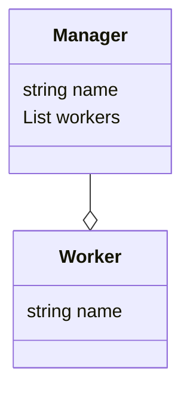

#### What is an aggregation relationship?

We talk about aggregation between two objects when one of them is an owner of the other one.

A manager has many workers under him. We can see that manager is the owner of a group of employees in his organization, and those employees are not going to report to another entity in the organization. The relationship between the manager and the employees are an aggregation relationship.

