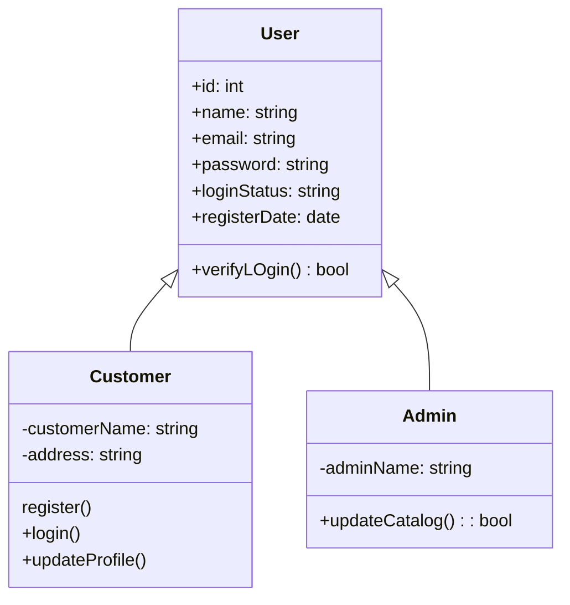

# Class Diagram

```mermaid
classDiagram
    class User{
        +id: int
        +name: string
        +email: string
        +password: string
        +loginStatus: string
        +registerDate: date
        +verifyLOgin() bool
    }

    class Admin{
        -adminName: string
        +updateCatalog(): bool
    }

    class Customer{
        -customerName: string
        -address: string
        register()
        +login()
        +updateProfile()        
    }

    User<|--Customer
    User<|--Admin

    

```