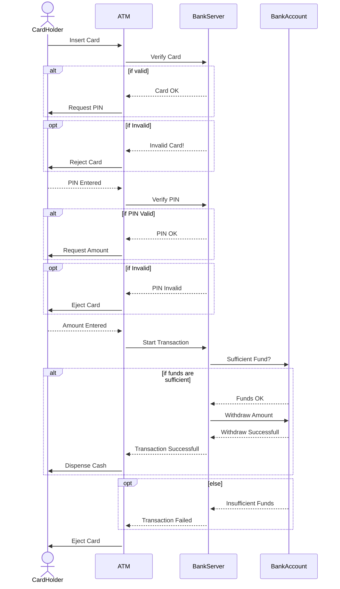

```mermaid
sequenceDiagram
    actor CardHolder
    participant ATM
    participant BankServer  
    participant BankAccount

    CardHolder->>+ATM: Insert Card
    ATM->>+BankServer: Verify Card
    alt if valid
        BankServer-->>ATM: Card OK
        ATM->>CardHolder: Request PIN
    end
    opt if Invalid
        BankServer-->>ATM: Invalid Card!
        ATM->>CardHolder: Reject Card
    end

    CardHolder-->>ATM: PIN Entered
    ATM->>BankServer: Verify PIN

    alt if PIN Valid
        BankServer-->>ATM: PIN OK
        ATM->>CardHolder: Request Amount
    end
    opt if Invalid
        BankServer-->>ATM: PIN Invalid
        ATM->>CardHolder: Eject Card
    end

    CardHolder-->>ATM: Amount Entered
    ATM->>BankServer: Start Transaction
    BankServer->>BankAccount: Sufficient Fund?

    alt if funds are sufficient
        BankAccount-->>BankServer: Funds OK
        BankServer->>BankAccount: Withdraw Amount
        BankAccount-->>BankServer: Withdraw Successfull
        BankServer-->>ATM: Transaction Successfull
        ATM->>CardHolder: Dispense Cash
    end
    opt else
        BankAccount-->>BankServer: Insufficient Funds
        BankServer-->>ATM: Transaction Failed
    end

    ATM->>CardHolder: Eject Card
    

```