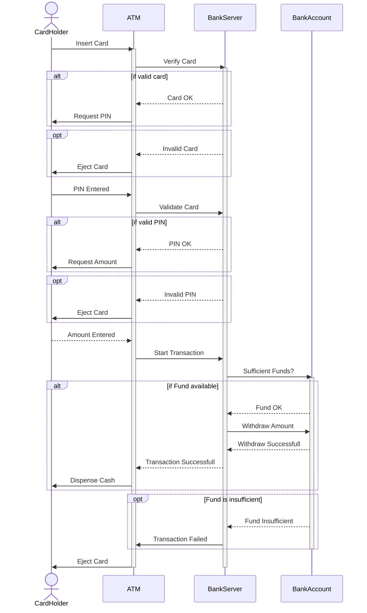

```mermaid

sequenceDiagram
    actor CardHolder
    participant ATM
    participant BankServer
    participant BankAccount

    CardHolder->>ATM:Insert Card
    activate ATM
    ATM->>BankServer:Verify Card
    activate BankServer

    alt if valid card
        BankServer-->>ATM: Card OK
        ATM->>CardHolder: Request PIN
    end
    opt
        BankServer-->>ATM: Invalid Card
        ATM->>CardHolder:Eject Card

    end

    CardHolder->>ATM:PIN Entered
    ATM->>BankServer: Validate Card

    alt if valid PIN
        BankServer-->>ATM:PIN OK
        ATM->>CardHolder:Request Amount
    end
    opt
        BankServer-->>ATM: Invalid PIN
        ATM->>CardHolder: Eject Card
    end

    CardHolder-->>ATM: Amount Entered
    ATM->>BankServer: Start Transaction

    BankServer->>BankAccount:Sufficient Funds?
    activate BankAccount

    alt if Fund available
        BankAccount-->>BankServer:Fund OK
        BankServer->>BankAccount: Withdraw Amount
        BankAccount-->>BankServer: Withdraw Successfull
        BankServer-->>ATM: Transaction Successfull
        ATM->>CardHolder: Dispense Cash
    end
    opt Fund is insufficient
        BankAccount-->>BankServer: Fund Insufficient
        BankServer->>ATM: Transaction Failed
                
    end
    deactivate BankAccount
    ATM->>CardHolder: Eject Card
    deactivate BankServer
    deactivate ATM

```