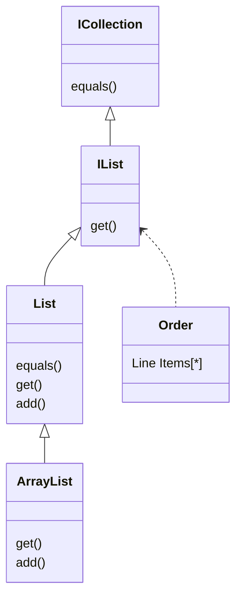

## Interface and Abstract Classes

```mermaid
classDiagram 
    class ICollection {
        equals()
    }
    class IList{
        get()
    }
    class List{
        equals()
        get()
        add()
    }

    class ArrayList{
        get()
        add()
    }

    class Order{
        Line Items[*]
    }

    ICollection<|--IList
    IList<|--List
    List<|--ArrayList

    IList<..Order

```