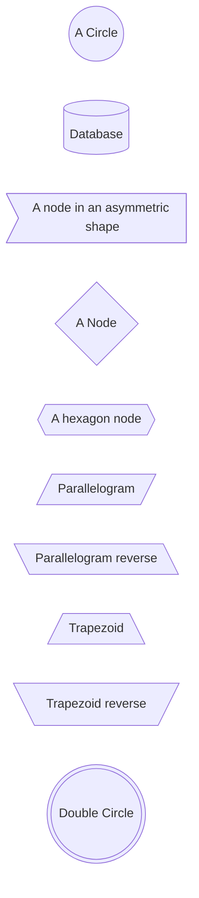
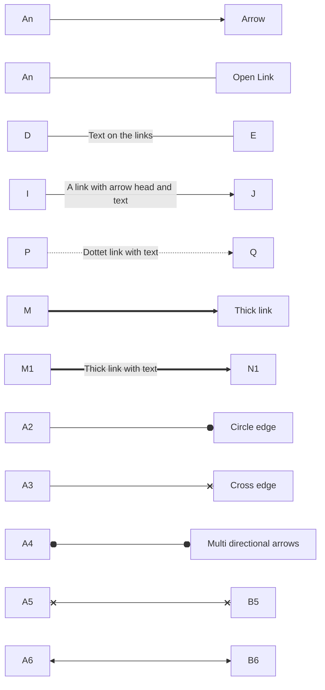

# Shape

```mermaid
flowchart LR
    id1((A Circle))
    id2[(Database)]
    id3>A node in an asymmetric shape]
    id4{A Node}

    id5{{A hexagon node}}
    id6[/Parallelogram/]

    id7[\Parallelogram reverse\]

    id8[/Trapezoid\]
    id9[\Trapezoid reverse/]

    id10(((Double Circle)))

```

# Link

```mermaid
flowchart LR
    An-->B[Arrow]
    X[An]---C[Open Link]
    D--Text on the links ---E
    I-->|A link with arrow head and text|J
    P-.Dottet link with text.->Q
    M ==> N[Thick link]
    M1 == Thick link with text ==>N1

    A2 --o B2[Circle edge]
    A3 --x B3[Cross edge]

    A4 o--o B4[Multi directional arrows]
    A5 x--x B5
    A6 <--> B6
```