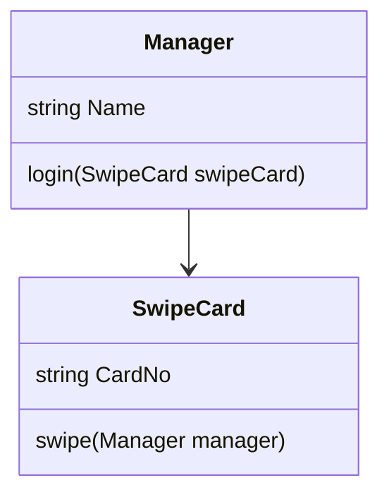

## Association

#### What is an association relationship?
We talk about association between two objects when one of them can use the other one, but also each of them can exist without the other one. There is no dependency between them.

A manager has a swipe card to enter the company premises. We can see the relationship "has a". That means a manager can exist without his swipe card, and his swipe card can also be assigned to another employee. The manager also can have another swipe card. The relationship between the manager and swipe card is an association relationship since they are not dependent on each other.

