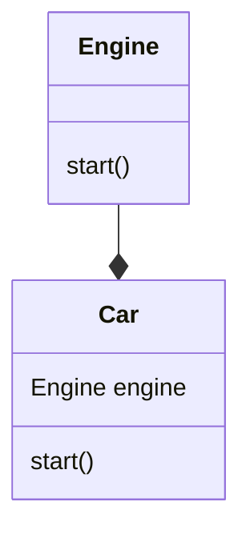

#### What is a composition relationship?

We talk about composition between two objects when they are dependent each other during their life time.

Composition is a relationship where one class contains another class as a member variable. The contained class, also called component, is created and destroyed with the parent class, and it cannot exist independently. 

