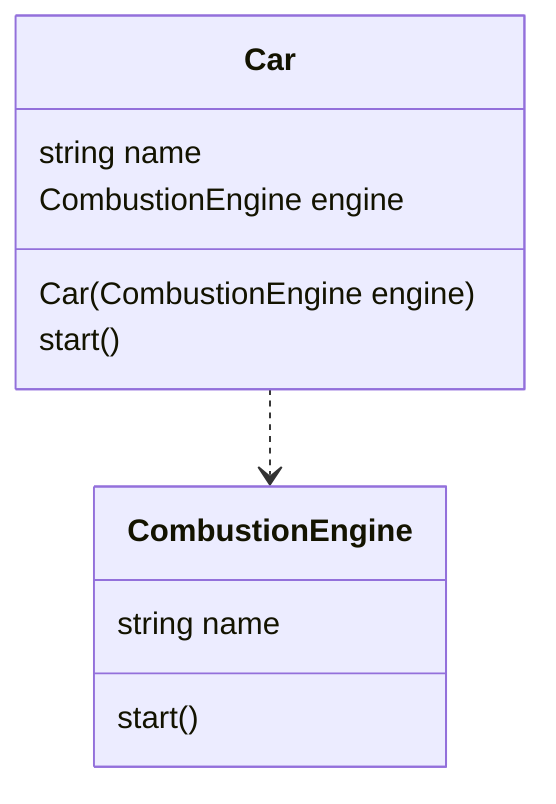
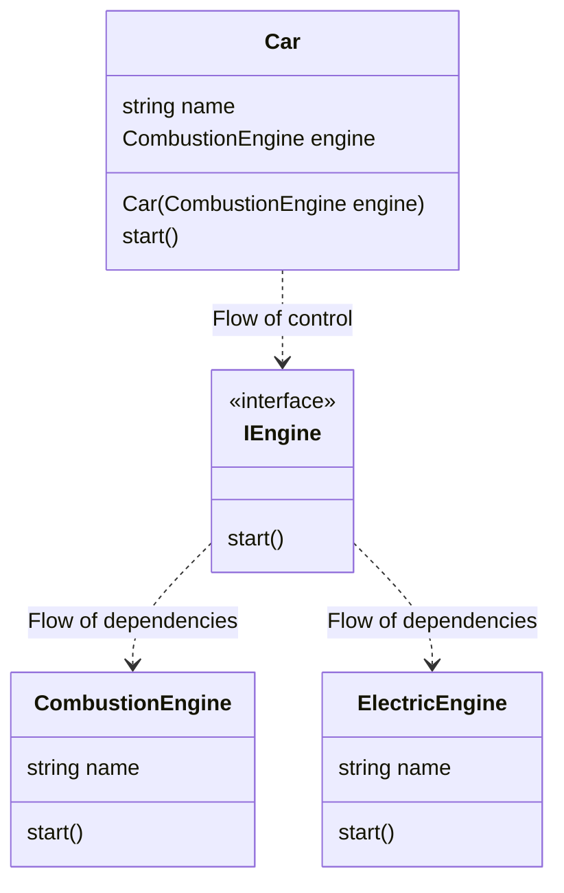

#### Dependency Inversion Principle
The Dependency Inversion Principle (DIP) emphasizes decoupling and abstraction. 

The principle consists of two core concepts:
    - high-level modules should not depend on low-level modules
    - both should depend on abstractions.
This inverted dependency relationship promotes flexbility, testability, and maintainability.

#### Without dependency inversion

#### Dependency Inversion

