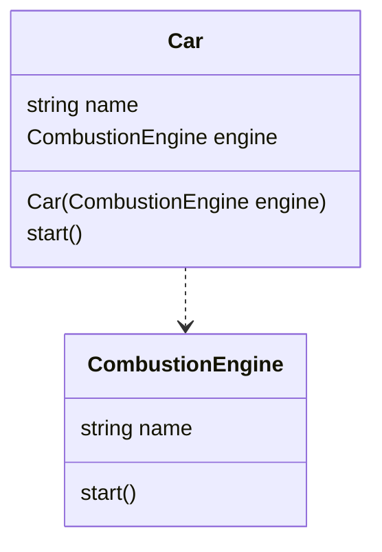
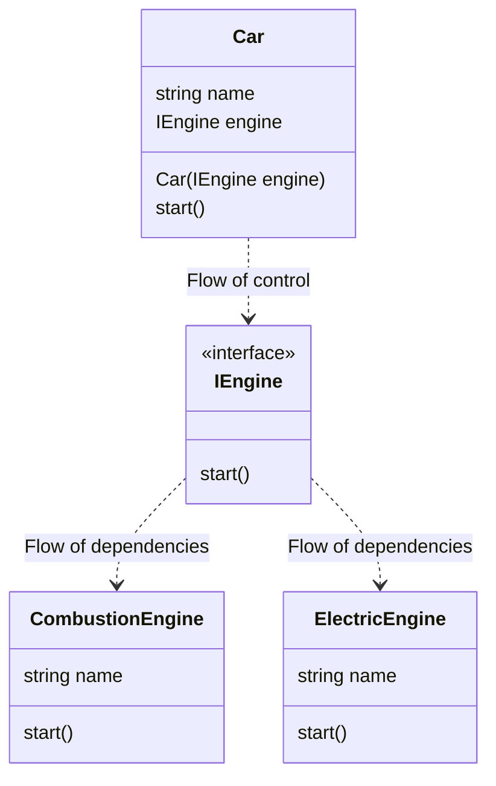

#### Dependency Inversion Principle
The Dependency Inversion Principle (DIP) emphasizes decoupling and abstraction. 

The principle consists of two core concepts:

    - High-level modules should not depend on low-level modules. Both should depend on abstractions.
    
    - Abstractions should not depend on details. Details should be depend upon abstractions

This inverted dependency relationship promotes flexbility, testability, and maintainability.

##### Why is the Dependency Inversion Principle Important?
Dependency Inversion Principle prevent us depending upon modules that often change. Concrete classes change frequently, while abstractions and interfaces change much less. 

DIP is key to achieving loosely coupled and maintainable systems alongside concepts such as Polymorphism or Dependency Injection.

#### Without dependency inversion

#### Dependency Inversion

#### Dependency Injecction is just a vehicle to achieve the inversion

